[](https://doi.org/10.5281/zenodo.23249712)# Using the Reproduction Set `repro/`
[Get the PDF version for the instructions if you feel more comfortable](./repro_guide.pdf)

**Scripts and data of the dynamic inoperability (DIIM) analysis of Spain's agri-food system submitted to the *International Journal of Critical Infrastructure Protection*.**
Package `envio_IJCIP`, directory `repro/`. 3 October 2026.

> This guide explains how to use the reproduction set shipped with the manuscript *Quantifying Cyber-Induced Cascades under Climate-Conditioned Recovery to Prioritise Critical-Infrastructure Defence: A Dynamic Inoperability Analysis of Spain's Agri-Food System*. The directory holds two official INE workbooks, twenty Python scripts and the JSON, CSV and NPZ files they produce. One command, `python3 run_all.py`, regenerates every number, table and figure of the manuscript in about fifty seconds and fails on the first discrepancy. The guide describes the environment, the order of the sixteen pipeline stages, what each script reads and writes, the values that identify a faithful run, and the scope of the Censys exposure material that is **not** part of the pipeline. Every statement was checked by running the set on a clean copy on 3 October 2026 with Python 3.12.3; the run regenerated all committed result files byte for byte.

A typeset version of this guide with the same content is `repro_guide.pdf` (source `repro_guide.tex`). The diagrams below are rendered from that source and stored in `docs/`.

**Contents**

1. [What the directory contains](#1-what-the-directory-contains)
2. [Environment](#2-environment)
3. [The pipeline at a glance](#3-the-pipeline-at-a-glance)
4. [The model the scripts implement](#4-the-model-the-scripts-implement)
5. [Script by script](#5-script-by-script)
6. [What a correct run looks like](#6-what-a-correct-run-looks-like)
7. [Data provenance](#7-data-provenance)
8. [The Censys exposure material](#8-the-censys-exposure-material)
9. [The six figures](#9-the-six-figures)
10. [Before editing anything](#10-before-editing-anything)

**Colour code used in the diagrams:** green cylinders are input data (INE workbooks); blue boxes are Python scripts; the red box is the verification stage; amber boxes are JSON/CSV/NPZ outputs; purple boxes are PNG figures.

---

## 1. What the directory contains

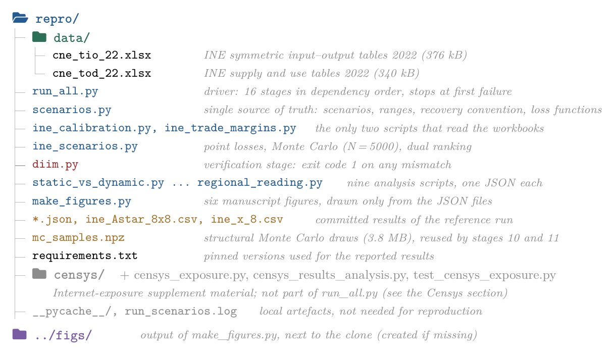

*Layout of `repro/`. Blue items are scripts, red the verification stage, amber the committed results, green the input data, purple the figure directory outside the clone.*

| Item | Role |
|---|---|
| `data/cne_tio_22.xlsx` | INE symmetric input–output tables 2022 (376 kB) |
| `data/cne_tod_22.xlsx` | INE supply and use tables 2022 (340 kB) |
| `run_all.py` | driver: 16 stages in dependency order, stops at first failure |
| `scenarios.py` | single source of truth: scenarios, ranges, recovery convention, loss functions |
| `ine_calibration.py`, `ine_trade_margins.py` | the only two scripts that read the workbooks |
| `ine_scenarios.py` | point losses, Monte Carlo (N = 5000), dual ranking |
| `diim.py` | verification stage: exit code 1 on any mismatch |
| `static_vs_dynamic.py` … `regional_reading.py` | nine analysis scripts, one JSON each |
| `make_figures.py` | six manuscript figures, drawn only from the JSON files |
| `*.json`, `ine_Astar_8x8.csv`, `ine_x_8.csv` | committed results of the reference run |
| `mc_samples.npz` | structural Monte Carlo draws (3.8 MB), reused by stages 10 and 11 |
| `requirements.txt` | pinned versions used for the reported results |
| `censys/` + `censys_exposure.py`, `censys_results_analysis.py`, `test_censys_exposure.py` | Internet-exposure supplement material; not part of `run_all.py` (Section 8) |
| `__pycache__/`, `run_scenarios.log` | local artefacts, not needed for reproduction |
| `../figs/` | output of `make_figures.py`, next to the clone (created if missing) |

---

## 2. Environment

The pipeline needs Python 3 with four third-party packages. TeX is not needed to run the scripts; it is needed only to compile the manuscript and the PDF version of this guide.

| Component | Reference run | Minimum in `requirements.txt` | Role |
|---|---|---|---|
| Python | 3.12.3 (Linux) | 3 | interpreter |
| numpy | 1.26.4 | ≥ 1.24 | linear algebra, random streams (PCG64) |
| scipy | 1.11.4 | ≥ 1.10 | matrix exponential, ODE check, distributions |
| matplotlib | 3.6.3 | ≥ 3.6 | figures (stage 16 only) |
| openpyxl | 3.1.5 | ≥ 3.1 | reading the INE workbooks (stages 1–4 only) |

```bash
cd repro
python3 -m venv .venv && source .venv/bin/activate
pip install -r requirements.txt
python3 run_all.py          # about 50 s; ends with "PIPELINE COMPLETED in 50 s"
```

> **Reproducibility of the random draws.** Point values do not depend on package versions beyond floating-point noise. Monte Carlo percentiles depend on numpy's `default_rng` (PCG64) stream seeded with 20260719, with child seeds `[20260719, k]` for the two-phase scenario A1 and for the extra seeds of the uncertainty decomposition. The stream is stable across the versions above, so envelopes reproduce bit for bit.

---

## 3. The pipeline at a glance

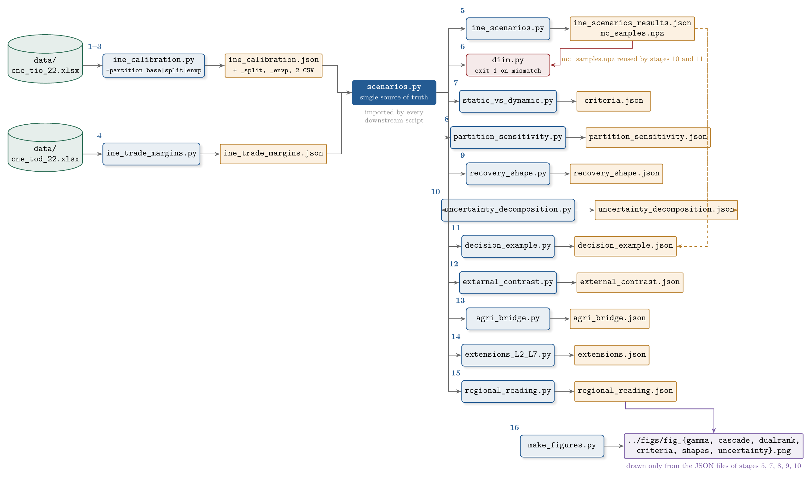

*Data flow of `run_all.py`. Stage numbers are the positions in the driver's list. Solid black arrows are read dependencies; the red arrow is the comparison performed by the verification stage; dashed amber arrows mark the reuse of the stored structural Monte Carlo draws.*

`run_all.py` executes the sixteen stages in order, each as a separate Python process with the directory of the script as working directory. If any stage exits with a non-zero code, the driver prints `PIPELINE FAILED at <script>` and stops. Only the first two scripts touch the INE workbooks. Every other script imports `scenarios.py` and reads the JSON files written upstream, so the manuscript, the stored results and the figures cannot drift apart.

### 3.1 Run times

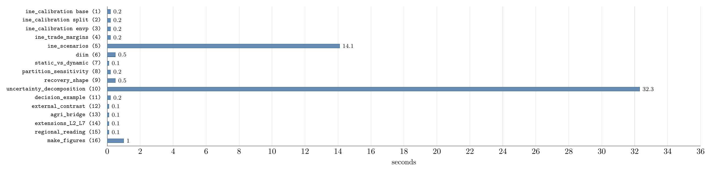

*Wall-clock time per stage (Python 3.12.3, pinned package versions), measured on the verification run of 3 October 2026. Stage numbers in parentheses.*

Two stages account for nearly all of the 50 s: the Monte Carlo of `ine_scenarios.py` (14.1 s) and the uncertainty decomposition (32.3 s). Everything else runs in a second or less.

### 3.2 Running a single stage

Each script is self-contained and resolves its paths relative to its own location, so it can be launched from any working directory. Stages must nevertheless respect the dependency order of the diagram above: a script fails with a missing-file error if the JSON it needs has not been written. The three calibration variants are selected by option:

```bash
python3 repro/ine_calibration.py --partition base    # also: split, envp
python3 repro/ine_scenarios.py                       # rewrites results JSON and mc_samples.npz
python3 repro/diim.py; echo "exit code $?"           # 0 = stored baseline reproduced
python3 repro/make_figures.py                        # ../figs/*.png from the JSON files
```

> ⚠️ **The `--audit` option.** `run_all.py --audit` additionally runs `../audit.py`, a manuscript audit that compares the JSON results with the numbers typed in the `.tex` sources. That script is not included in this `envio_IJCIP` package, so the option fails here with a file-not-found error. Use the plain `python3 run_all.py`.

---

## 4. The model the scripts implement

The code implements the demand-side dynamic inoperability input–output model (DIIM) of Santos and Haimes with the recovery calibration of Lian and Haimes. All definitions live in `scenarios.py`; the formulas below are transcribed from its docstring.

| | |
|---|---|
| Interdependence | $a^{*}_{ij} = Z_{ij}/x_i$: share of supplier $i$'s sales absorbed by customer $j$. $A^{*} = D^{-1} A D$ with $D=\operatorname{diag}(x)$. |
| Recovery | $k_i = \ln 100 \,/\, \big(T_i (1 - a^{*}_{ii})\big)$: an isolated sector keeps 1 % of its inoperability after $T_i$ days. |
| Dynamics | $\dot q = K\,[A^{*} q + c^{*} - q]$, with $K = \operatorname{diag}(k_i)$ and $c^{*}$ the sustained forcing (zero for transient shocks). |
| Loss | $\Gamma(H) = \frac{1}{365}\, x^{\top}\!\int_0^H q(t)\,dt$ in EUR million at 2022 basic prices, reported at $H = 120$ days. |
| Closed form | $\Gamma_\infty = \sum_{j\ \text{targeted}} q_j(0)\, T_j\, (1-a^{*}_{jj})\, w_j \,/\, (365 \ln 100)$, with exposure weight $w_j = [x^{\top}(I-A^{*})^{-1}]_j = x_j m_j$ and $m_j$ the Leontief output multiplier. |

<table>
<tr>
<td width="46%" align="center">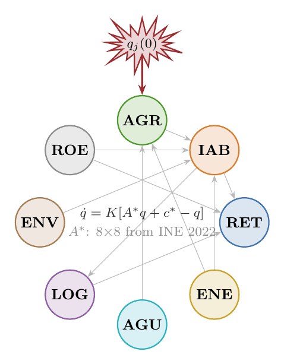</td>
<td width="54%" align="center">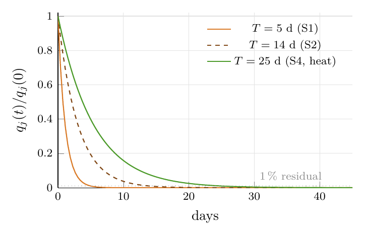</td>
</tr>
<tr>
<td><em>(a) A cyber shock sets the initial inoperability q<sub>j</sub>(0) of a targeted sector; A* propagates it to customers and suppliers. Grey arrows are illustrative couplings, not weighted.</em></td>
<td><em>(b) The reference time T<sub>i</sub> fixes an isolated exponential recovery q<sub>j</sub>(t) = q<sub>j</sub>(0) e<sup>−t ln100/T<sub>j</sub></sup> that reaches 1 % at T<sub>j</sub>. Heat multiplies T of AGR by 1.5 and of AGU by 2.5.</em></td>
</tr>
</table>

*The two ingredients of the model: the interdependence matrix calibrated on INE data and the recovery convention declared per scenario.*

### 4.1 From 65 INE products to 8 sectors

`ine_calibration.py` aggregates the 65 CPA products of the INE symmetric table by summing flows ($Z_{\mathrm{agg}}[I,J] = \sum_{p\in I,\,q\in J} Z[p,q]$, $x_{\mathrm{agg}}[I] = \sum_{p\in I} x[p]$). The base partition is shown below; two alternative partitions serve the aggregation-sensitivity analysis.

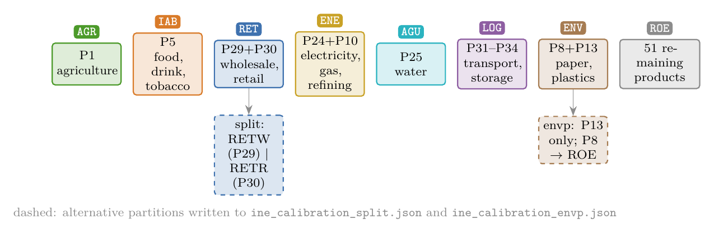

*Base partition of the INE products into eight sectors and the two variants used by `partition_sensitivity.py`. Documented ambiguities: fishing and forestry outside AGR, vehicle trade outside RET, postal services outside LOG, tobacco inside IAB, ENV a partial packaging proxy.*

### 4.2 Scenario catalogue

All scenarios are declared once in `scenarios.py` (dictionaries `SCN`, `RANGES`, `A1_TWO_PHASE`). Point values are the modes of triangular exploratory distributions; the brackets give their ranges. Baseline reference recovery times are τ = (20, 10, 7, 4, 8, 6, 6, 10) days for (AGR, IAB, RET, ENE, AGU, LOG, ENV, ROE).

| Code | Scenario | Target | Heat | q(0) point [range] | T days [range] |
|---|---|---|---|---|---|
| S1 | Single food-industry operator at a standstill | IAB | | 0.02 [0.005, 0.03] | 5 [3, 10] |
| S2 | Coordinated industry campaign (harvest, sector-wide stress) | IAB | | 0.20 [0.10, 0.25] | 14 [7, 45] |
| S3 | Irrigation SCADA/IoT compromise | AGR | | 0.15 [0.10, 0.20] | 10 [7, 14] |
| S4 | Irrigation SCADA/IoT compromise under heatwave | AGR | ☀ | 0.15 [0.10, 0.20] | 25 [15, 35] |
| S5 | Compound: industry + irrigation, heatwave | IAB, AGR | ☀ | 0.20 / 0.15 | 14 / 25 |
| A1 | Silent fertigation integrity drift, two-phase | AGR | | c̄ = 0.10 [0.05, 0.15] | t<sub>d</sub> = 30 [21, 45]; T<sub>rem</sub> = 10 [7, 14] |
| A1-T | Transient comparison case of A1 | AGR | | 0.10 [0.05, 0.15] | 30 [21, 45] |
| G1 | Livestock climate/ventilation control | AGR | | 0.12 [0.08, 0.15] | 8 [5, 12] |
| R1 | Retail ransomware: ERP, distribution centres, cold chain | RET | | 0.04 [0.01, 0.05] | 9 [5, 45] |
| C1 | Mediterranean-arc compound (harvest + heat) | AGR, IAB, RET | ☀ | 0.15 / 0.20 / 0.04 | 25 / 14 / 9 |

*☀ marks heat-conditioned recovery (AGU × 2.5, AGR × 1.5; Monte Carlo ranges U[1.5, 3.5] and U[1.2, 2.0]). A1 is the principal two-phase representation (sustained depth until detection, then remediation); A1-T is its transient counterpart.*

---

## 5. Script by script

### `ine_calibration.py --partition base|split|envp` — stages 1–3
*Reads `data/cne_tio_22.xlsx`. Writes `ine_calibration.json` (or `_split`, `_envp`), `ine_Astar_8x8.csv`, `ine_x_8.csv`.*

Reads sheet `Tabla2` (domestic product-by-product flows, EUR million), the row *Producción a precios básicos* of `Tabla1` (output vector) and `Tabla5` (technical coefficients, used only as an independent check of $A = Z\operatorname{diag}(x)^{-1}$). Aggregates to the partition of Section 4.1, checks the accounting identities and the spectral radius $\rho(A^{*}) < 1$, and stores $x$, $A$, $A^{*}$, the backward and forward exposure weights and the output multipliers.

### `ine_trade_margins.py` — stage 4
*Reads `data/cne_tod_22.xlsx`. Writes `ine_trade_margins.json`.*

From the supply table at basic prices derives the output of trade services (products 64 and 65, which equals $x_{\mathrm{RET}}$), the net trade margins reassigned by INE, the margins generated on agri-food products and the output of meat products. With the 2022 turnover of wholesale and retail trade (INE structural business statistics) it converts the net sales of the largest grocer into a margin-basis output and a share of RET of 0.040–0.042, which fixes $q_{\mathrm{RET}}(0) = 0.04$ in scenario R1.

### `ine_scenarios.py` — stage 5
*Reads the calibration JSON and `scenarios.py`. Writes `ine_scenarios_results.json` and `mc_samples.npz`.*

Computes the point losses $\Gamma(120)$ and $\Gamma_\infty$ of every scenario, the dual (backward/forward) ranking for S2, and the exposure weights. Runs the exploratory Monte Carlo: $N = 5000$, seed 20260719; non-zero $a^{*}_{ij}\times\mathrm{U}[0.8, 1.2]$, $x_i\times\mathrm{U}[0.9, 1.1]$, triangular $q$ and $T$, heat multipliers as in the scenario table. A Gaussian-copula sweep with equicorrelation $\rho\in\{0, 0.5, 1\}$ among the $q$ and $T$ of a scenario is reported; rank frequencies are recorded under three prioritisation criteria. The structural draws ($A^{*}$, $\hat x$, heat multipliers) are saved to `mc_samples.npz` so that later stages reuse exactly the reference run. Slow stage: about 14 s.

### `diim.py` — stage 6, verification
*Reads `ine_scenarios_results.json` and `scenarios.py`. Writes nothing. Exit code 1 on any mismatch.*

Independent checks of the implementation: matrix-exponential trajectories against an ODE integrator; the loss identity $\Gamma(H) = x^{\top}W(H)/365$; the closed form $\Gamma_\infty = x^{\top}(I-A^{*})^{-1}K^{-1}q(0)/365$; linearity in $T$ ($\Gamma_\infty(\mathrm{S4})/\Gamma_\infty(\mathrm{S3}) = 2.5$); additivity $\mathrm{C1} = \mathrm{S4} + \mathrm{S2} + \mathrm{R1}$ at infinite horizon; forward invariance of $[0,1]^n$; and equality of every point loss with the stored baseline. Because the stage fails loudly, a stale or edited reproduction set cannot pass silently.

### `static_vs_dynamic.py` — stage 7
*Writes `criteria.json`.*

Three prioritisation criteria among the focal sectors, each answering a different question: $w_j$ (equal integrated inoperability), $m_j = w_j/x_j$ (equal integrated monetary withdrawal; the Leontief output multiplier) and $v_j = \tau_j (1-a^{*}_{jj}) w_j/(365\ln 100)$ (loss per unit of initial inoperability at the baseline recovery time).

### `partition_sensitivity.py` — stage 8
*Reads the three calibration JSON files. Writes `partition_sensitivity.json`.*

Recomputes criteria and the losses of S2, S4 and C1 under the `base`, `split` and `envp` calibrations. Under `split`, R1 is re-specified on retail trade (RETR) with a point injection of 0.10 (range 0.05–0.12).

### `recovery_shape.py` — stage 9
*Writes `recovery_shape.json`.*

Compares recovery paths with the same $q_j(0)$: exponential (reference), plateau then exponential, plateau with the same end date, linear ramp and three steps. With the target's path exogenous, $\Gamma_\infty$ scales exactly with the area under that path; the DIIM proper (endogenous target) is also reported. A numerical integration checks the closed form.

### `uncertainty_decomposition.py` — stage 10
*Reads `mc_samples.npz`. Writes `uncertainty_decomposition.json`.*

(a) Envelopes under uniform and PERT marginals instead of triangular, reusing the stored structural draws. (b) One-at-a-time variance shares on the log scale: depth, recovery, structure. (c) Convergence: split-half percentiles and three further seeds. Slowest stage: about 32 s.

### `decision_example.py` — stage 11
*Reads `mc_samples.npz`. Writes `decision_example.json`.*

Illustrative protection decision on S2 with two *assumed* measures: depth control ($q_{\mathrm{IAB}}(0)$ from 0.20 to 0.18) and restoration control ($T$ from 14 to 12 days). Reports the avoided loss of each, the joint benefit and the cross term, with envelopes from the stored draws.

### `external_contrast.py` — stage 12
*Writes `external_contrast.json`.*

Converts two documented incidents (JBS 2021; Maersk/NotPetya 2017 as compiled by Welburn and Strong) into full-stop-equivalent days $D_{\mathrm{eq}} = T/\ln 100$ and contrasts the triangular $T$ ranges with the Sophos 2025 recovery-time survey.

### `agri_bridge.py` — stage 13
*Writes `agri_bridge.json`.*

Decomposes the agricultural injection as $q_{\mathrm{AGR}}(0) = \pi\,\varphi\,h$ with public anchors for $\pi$ (MAPA 2024 crop, irrigation, pigmeat and poultry shares). It does not estimate $\varphi$ or $h$; the products implied by the point injections and ranges are printed and flagged as pending operator data.

### `extensions_L2_L7.py` — stage 14
*Writes `extensions.json`.*

L2: two-phase integrity attack A1 over detection latency and remediation time, and its ratio to the transient A1-T. L3: adversarial timing premium with a seasonal $T_{\mathrm{AGR}}$. L4: single-counted channel corridor $A_{\max} = \max(A^{*}, A_{\mathrm{fwd}})$ element-wise, with $\Gamma_\infty$ and the focal ranking under both matrices.

### `regional_reading.py` — stage 15
*Writes `regional_reading.json`.*

National loss of an incident confined to Andalusia or the Mediterranean arc (INE 2024 output shares as proxies); location of $\Gamma_\infty$ by receiving sector in S2, S4, R1, C1; sensitivity of $\Gamma_\infty(\mathrm{S4})$ to AGR's purchase and sales structure.

### `make_figures.py` — stage 16
*Reads `ine_scenarios_results.json`, `criteria.json`, `partition_sensitivity.json`, `recovery_shape.json`, `uncertainty_decomposition.json`. Writes `../figs/*.png`.*

Draws the six manuscript figures at 300 dpi (single column 3.4 in, double column 7.0 in). No number is typed in the script. The output directory is created if missing.

---

## 6. What a correct run looks like

A faithful run ends with the line `PIPELINE COMPLETED in 50 s` (give or take the speed of the machine) and leaves the JSON, CSV and NPZ files identical to the committed ones. The values below are read directly from those files and identify the reference run.

| Quantity | Value | File | Key |
|---|---|---|---|
| ρ(A*) | 0.4130 | `ine_calibration.json` | `rho` |
| Output x (EUR M): AGR, IAB, RET | 61 984; 160 266; 245 096 | `ine_calibration.json` | `x` |
| Exposure weights w (EUR M): RET, IAB, LOG | 405 025; 362 960; 291 364 | `ine_calibration.json` | `w_backward` |
| Γ(120) of S1, S3, G1, R1 (EUR M) | 17.9; 104.6; 67.0; 84.2 | `ine_scenarios_results.json` | `baseline` |
| Γ(120) of S2, S4, S5, C1 (EUR M) | 501.6; 261.6; 763.2; 847.4 | `ine_scenarios_results.json` | `baseline` |
| Γ(120) of A1-T and two-phase A1 (EUR M) | 209.3; 912.0 | `ine_scenarios_results.json` | `baseline` |
| Cyber-climate margin S4 − S3 (EUR M) | 157.0 | `ine_scenarios_results.json` | `marginal_climate` |
| S2 envelope P5 / P50 / P95, ρ = 0 (EUR M) | 324 / 668 / 1292 | `ine_scenarios_results.json` | `envelopes` |
| Monte Carlo size, valid draws, seed | 5000, 5000, 20260719 | `ine_scenarios_results.json` | `n_samples`, `n_valid`, `seed` |
| Largest grocer's share of RET | 0.0401–0.0420 | `ine_trade_margins.json` | `largest_grocer` |

*All values were read from the committed files on 3 October 2026 after regenerating them.*

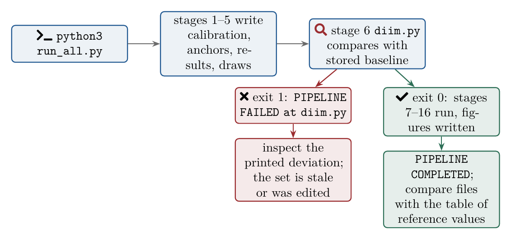

*Decision path of a run. The verification stage sits between the result-producing stages and the analysis stages, so downstream JSON files are only rewritten from a baseline that passed.*

> ✅ **Verification performed for this guide.** On 3 October 2026 the directory was copied to a clean location with the pinned package versions and `run_all.py` was executed. The run completed in 50 s. Every JSON and CSV file and `mc_samples.npz` were compared with the committed copies with `cmp`: no differences. The six PNG figures were written to `../figs/`. The offline Censys tests (`python3 -m unittest test_censys_exposure`) passed, 5 tests.

---

## 7. Data provenance

| File | Source | Read by |
|---|---|---|
| `data/cne_tio_22.xlsx` | INE, *Contabilidad Nacional Anual de España, Revisión Estadística 2024*, symmetric input–output tables, reference year 2022, published 19 December 2025. Sheets `Tabla1` (production at basic prices), `Tabla2` (domestic product-by-product flows, 65 products, EUR M), `Tabla5` (technical coefficients, check only). | `ine_calibration.py` |
| `data/cne_tod_22.xlsx` | INE, same release, supply and use tables 2022. Sheet `Tabla1` (supply table at basic prices with the transformation to purchasers' prices). | `ine_trade_margins.py` |

"Revisión Estadística 2024" names the accounting revision; the reference year of both tables is 2022. The workbooks are official public data under INE's conditions of use and are never modified by the scripts.

Other anchors (MAPA agricultural accounts, Mercasa, INE structural business statistics, the largest grocer's net sales, incident reports and the Sophos survey) are typed as constants in the scripts that use them, with their sources in the docstrings and in the manuscript's reference list.

> ⚠️ **Scenario-conditioned, not predictive.** The calibration is empirical. The shock depths, recovery times and climate multipliers are declared scenario assumptions, and the Monte Carlo percentiles are exploratory simulation envelopes, not confidence intervals. Nothing produced by this set is a forecast.

---

## 8. The Censys exposure material

The manuscript has a supplement on the Internet-facing exposure, in Spain, of the device classes attacked in the scenarios, built from **aggregate** Censys Platform counts (no host lists, no individual records). The files in `censys/` and the three `censys_*` scripts belong to that supplement. None of them is part of `run_all.py`, and two of the scripts need inputs that are deliberately not shipped.

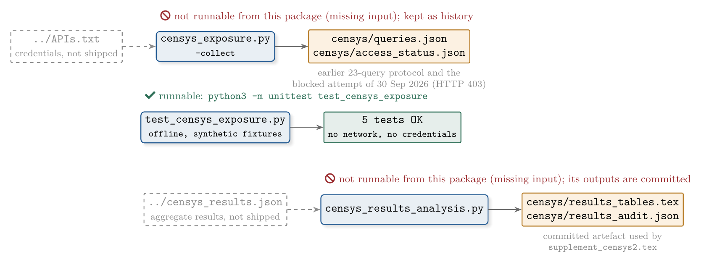

*The Censys material. Dashed grey boxes are inputs that are not distributed. Only the offline test module can be executed from a clean copy.*

- `censys_exposure.py` implements the earlier aggregate-only query protocol. Its default action is offline plan generation; `--collect` would issue 23 aggregate requests to the documented endpoint and consumes account credits. It reads credentials from `../APIs.txt`, which is not part of the package. `censys/access_status.json` records that the attempt of 30 September 2026 was blocked before any data was retrieved.
- `censys_results_analysis.py` audits the aggregate results supplied in `../censys_results.json` (37 queries, SHA-256 recorded in the audit) and writes the LaTeX macros of `censys/results_tables.tex` and the checks of `censys/results_audit.json`. Standard library only. The source file is not shipped, so the committed outputs are the reproduction artefact.
- `censys/README.md` (in Spanish) states the scope, units and limits of that analysis: the port-based counts are not host or device censuses, no agri-food attribution is applied, and exposure is not mapped onto any DIIM parameter.

---

## 9. The six figures

Stage 16 writes the figures below to `../figs/`. Each panel is drawn from the JSON files alone; sector colours are fixed across figures and one hue is used per measure.

<table>
<tr>
<td width="33%" align="center">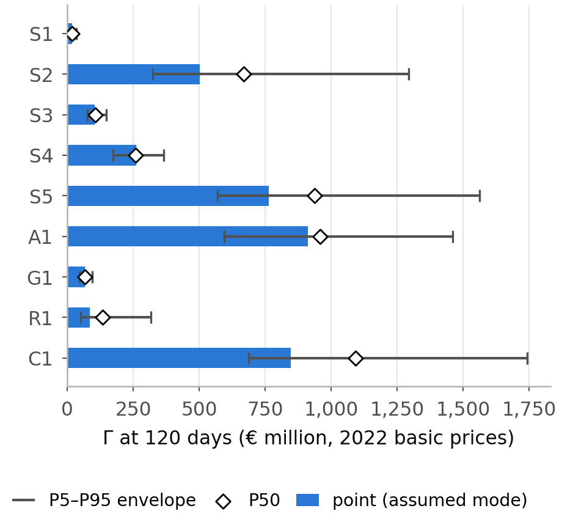<br><em>(a) <code>fig_gamma</code>: point loss, P5–P95 envelope and P50 by scenario.</em></td>
<td width="33%" align="center">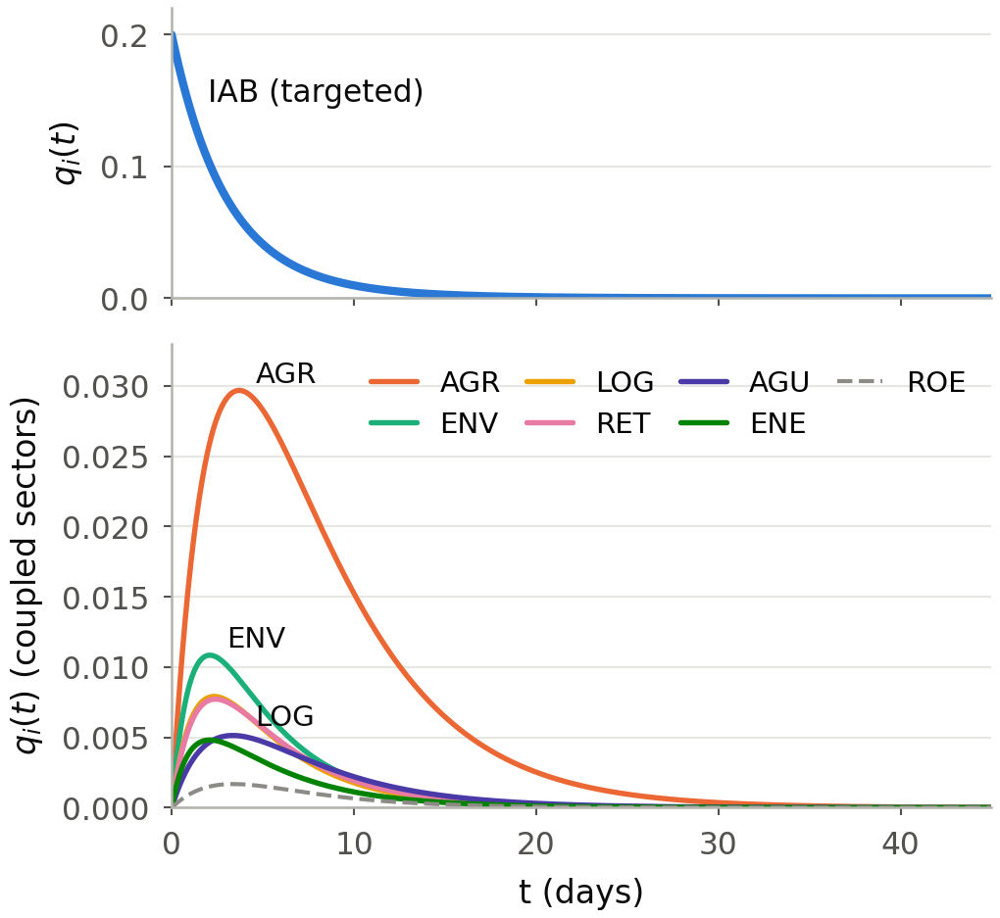<br><em>(b) <code>fig_cascade</code>: S2 trajectories of the targeted and coupled sectors.</em></td>
<td width="33%" align="center">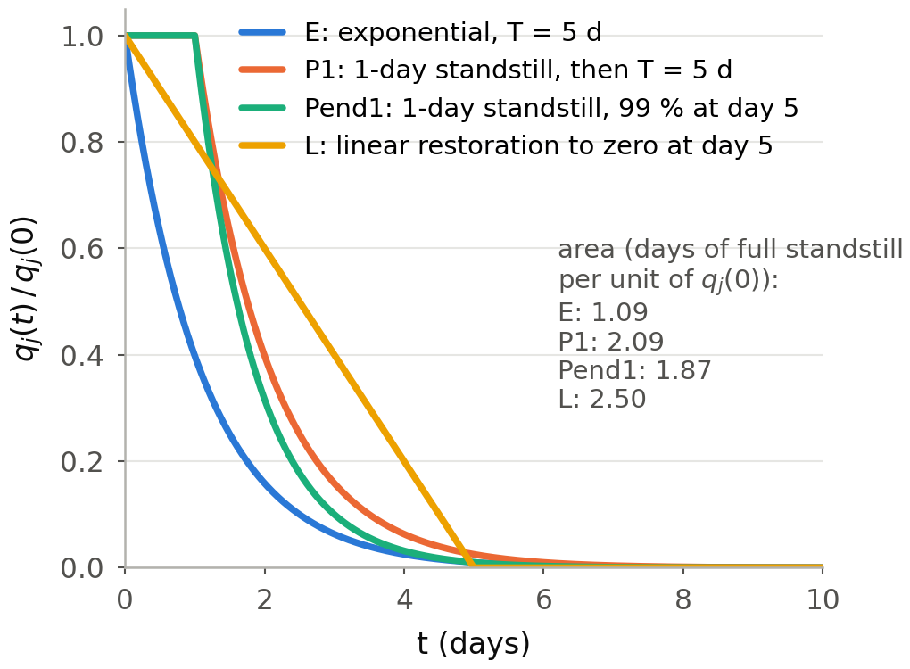<br><em>(c) <code>fig_shapes</code>: temporal forms of the targeted sector's recovery (S1).</em></td>
</tr>
<tr>
<td colspan="1" align="center">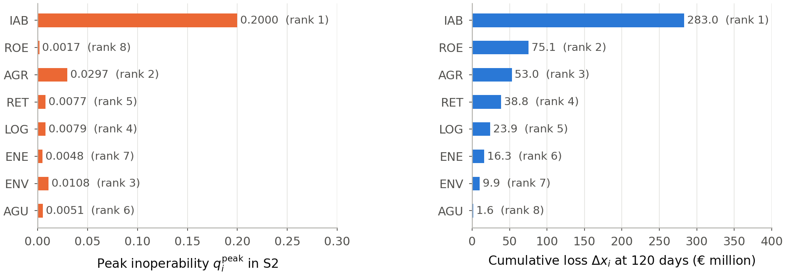<br><em>(d) <code>fig_dualrank</code>: S2 dual ranking as two aligned panels.</em></td>
<td colspan="1" align="center">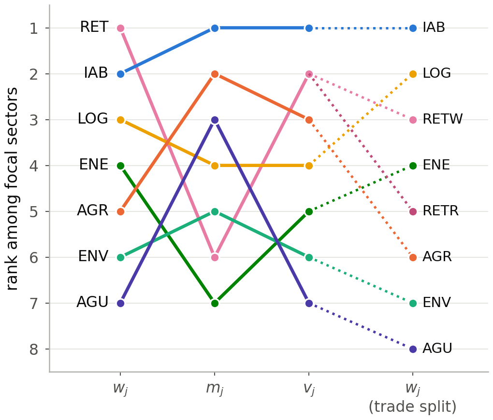<br><em>(e) <code>fig_criteria</code>: rank of each focal sector under w, m, v and w with trade split.</em></td>
<td colspan="1" align="center">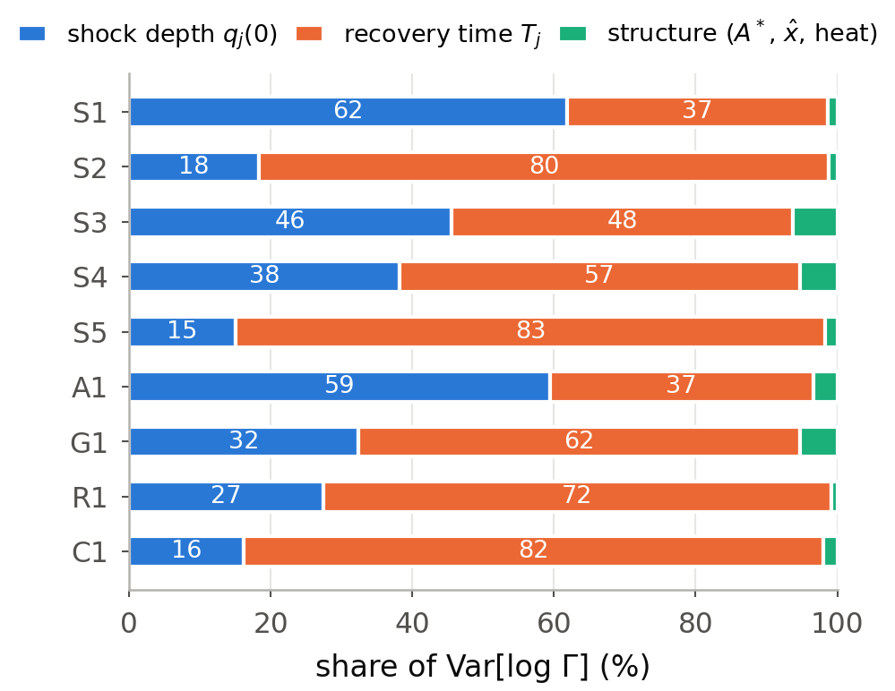<br><em>(f) <code>fig_uncertainty</code>: share of log-variance by source (depth, recovery, structure).</em></td>
</tr>
</table>

*The manuscript figures as regenerated by `make_figures.py` on 3 October 2026.*

---

## 10. Before editing anything

- **Change scenarios only in `scenarios.py`.** Every downstream script imports its dictionaries; assertions there check that each point value lies inside its range.
- **Rerun from stage 5 after any change upstream.** The verification stage compares against the stored `ine_scenarios_results.json`; if you change the calibration or a scenario, `ine_scenarios.py` must rewrite that file first, otherwise `diim.py` will stop the pipeline by design.
- **Do not delete `mc_samples.npz` casually.** Stages 10 and 11 reuse these structural draws; `ine_scenarios.py` regenerates the file, but only with the pinned numpy stream will it be bit-identical.
- **Figures go outside the clone.** `make_figures.py` writes to the sibling directory `../figs/`, which the manuscript includes.
- **`__pycache__/` and `run_scenarios.log`** are local artefacts and can be removed.
